# Project LINGKOD: System Workflow

## 1. Overview

This document details the end-to-end workflow of the Project LINGKOD system, from data ingestion to insight generation and alert dissemination. It defines the core logic of the `InsightGenerationEngine` and the processes for both standalone and complementary operational modes.

## 2. Workflow Diagram

```mermaid
graph TD
    subgraph "Data Ingestion Layer"
        A[Satellite Imagery API]
        B[Coram.ai CCTV Webhooks]
        C[DMA-BD IoT Sensor Push]
    end

    subgraph "Insight Generation Engine"
        D[Data Fusion & Correlation]
        E{Rule Evaluation}
        F[Insight Object Generation]
        G[Priority Queue Ranking]
        H[Evidence Panel Assembly]
    end

    subgraph "Operator Review & Approval"
        I[Insight Cards Display]
        J{Operator Review}
        K[Approval/Rejection]
    end

    subgraph "Output & Dissemination Layer"
        L[Standalone Mode: Coram.ai EMS]
        M[Complementary Mode: API Feed for ArcGIS]
        N[Alert Dissemination]
    end

    A --> D
    B --> D
    C --> D
    D --> E

    E -- Rule Met --> F
    E -- Rule Not Met --> D

    F --> G
    G --> H
    H --> I

    I --> J
    J -- Approved --> K
    J -- Rejected --> I

    K --> L
    K --> M
    K --> N

    subgraph "Last-Mile Channels"
        O[SMS Gateway]
        P[Radio Broadcast Scripts]
        Q[Barangay Official Alerts]
    end

    N --> O
    N --> P
    N --> Q

    style F fill:#9cf,stroke:#333,stroke-width:2px
    style I fill:#ccf,stroke:#333,stroke-width:2px
    style K fill:#9cf,stroke:#333,stroke-width:2px
```

## 3. Data Ingestion Layer

This layer is responsible for receiving data from all external sources.

### 2.1. Satellite Imagery
- **Source:** [Provider TBD]
- **Frequency:** Daily
- **Process:** The system will pull the latest provincial imagery via API.
- **Initial Analysis:** Pre-processing for change detection, vegetation stress, and soil moisture.

### 2.2. AI-Powered CCTV Alerts
- **Source:** Coram.ai Platform
- **Frequency:** Real-time
- **Process:** The system receives push notifications (webhooks) for critical events.
- **Data Points:** Event type (e.g., "RapidWaterLevelRise"), location, timestamp, severity.

### 2.3. IoT Sensor Network
- **Source:** DMA-BD Sensor Stations
- **Frequency:** Every 15 minutes
- **Process:** The system receives data pushed from the sensor network's central server.
- **Data Points:** Water level (AWLG), rainfall rate (ARG), weather data (AWS).

## 3. Insight Generation Engine

This is the core processing layer where data is fused and predictive insights are generated from the Insight Catalog.

### 3.1. Data Correlation
- The engine correlates data streams based on geographic proximity and time.
- **Example:** An IoT sensor's high rainfall reading is correlated with a nearby CCTV alert for rising water levels.

### 3.2. Insight Catalog Evaluation
- The engine evaluates correlated data against the predefined Insight Catalog, which includes:
    1.  **Barangay Flood Watch:** `(ARG > 20mm/hr for 1hr)` AND `(AWLG increase > 0.5m in 15min)` -> **Severity 3 Insight**.
    2.  **Sustained Rainfall Watch:** `(ARG > 10mm/hr for 3hrs)` -> **Severity 2 Insight**.
    3.  **Landslide Watch:** `(ARG > 15mm/hr for 2hrs)` AND `(satellite soil saturation > 80%)` -> **Severity 3 Insight**.
    4.  **Quake Rapid Impact Estimation:** `(seismic sensor data)` -> **Severity varies by magnitude**.
    5.  **Hotspot Escalation Score:** `(CCTV anomaly detection)` -> **Severity based on pattern analysis**.
    6.  **Critical Facility Impact:** `(infrastructure proximity analysis)` -> **Severity based on facility criticality**.
    7.  **Route Vulnerability Advisory:** `(road condition analysis)` -> **Severity based on traffic impact**.

### 3.3. Insight Object Generation
- When catalog conditions are met, a structured insight object is created with an associated Evidence Panel.
- **Insight Object Schema:** Contains `insightId`, `timestamp`, `area` (municipality, barangay), `geometry` (GeoJSON), `insightType`, `description`, `severity`, and `evidencePanel`.

### 3.4. Priority Queue Ranking
- Generated insights are ranked by exposure-weighted risk to prioritize operator attention.
- **Ranking Factors:** Geographic population density, historical vulnerability, current weather conditions, and insight severity.

### 3.5. Evidence Panel Assembly
- Each insight includes a comprehensive Evidence Panel showing:
    - Contributing data sources and their values
    - Rule traces and threshold comparisons
    - Confidence scores and uncertainty metrics
    - Visual evidence (CCTV snapshots, satellite imagery overlays)
    - Historical context and trend analysis

## 4. Output & Dissemination Layer

This layer handles the delivery of alerts to the appropriate channels.

### 4.1. Standalone Mode (Coram.ai EMS)
- **Target:** PDRRMO Operator
- **Process:** The generated alert object is sent to the Coram.ai EMS API.
- **Visualization:** The alert is displayed on the EMS map dashboard, highlighting the affected area using the GeoJSON geometry.
- **Action:** The operator verifies the alert and triggers the "last-mile" communication workflow.

### 4.2. Complementary Mode (API Feed)
- **Target:** Existing City-Level Command Centers (e.g., ArcGIS-based)
- **Process:** The generated alert object is made available via the secure `/api/v1/alerts` endpoint.
- **Consumption:** Third-party systems can poll this endpoint to ingest high-fidelity, actionable alerts directly into their own platforms.

### 4.3. Last-Mile Communication (Triggered from Standalone Mode)
- **Process:** Based on the verified alert, the Emergency Command Platform generates targeted messages.
- **Channels:**
    1.  **SMS Gateway:** Sends pre-formatted warnings to registered residents in the affected barangay.
    2.  **Radio Broadcast:** Generates a script for local radio stations with clear, simple instructions.
    3.  **Barangay Officials:** Sends a detailed alert and instructions directly to local leaders.

## 5. Operator Review, Approval & Audit

- States: Draft -> Pending Review -> Approved -> Disseminated -> Rescinded.
- Approval gate: All citizen-facing alerts are gated behind operator approval in the EMS.
- Evidence panel (per alert): correlated sensor readings (ARG/AWLG/AWS), CCTV event snapshots/metadata, satellite-derived indicators (if any), rule trace (which rules fired), thresholds, and confidence score.
- Operator actions: verify geometry and affected barangays, add instructions, adjust severity (within governed bounds), approve/deny with reason.
- Audit trail: every action is logged (user, timestamp, fields changed, reason); immutable event log supports after-action reviews and governance audits.
- Escalation: conflicting signals or high severity auto-page a senior operator; SLA timers highlight pending approvals breaching thresholds.

## 6. Feedback Loop to Rule Packs

- Post-event review: after-action reviews compare alerts vs. observed impacts and PAGASA bulletins; misclassifications are labeled.
- Tuning workflow: proposed threshold/rule changes are captured as change requests; Advisory Board reviews/approves; rule packs are versioned (semantic versioning) and scheduled for rollout.
- Shadow evaluation: candidate rule changes run in shadow mode before activation to measure impact on precision/recall and lead time.

## 7. Data & Model Governance Overview

- Rule packs: YAML/JSON, version-controlled; each alert records the rule pack version used.
- ML components (if any): documented via model cards with training data provenance; can be toggled off per rule; evaluation reports attached to change requests.
- Security & retention: access-controlled EMS/API; encryption in transit/at rest; retention and deletion policies aligned with PDRRMO guidance.
- Monitoring: dashboards for data freshness, ingestion lag, and sensor anomalies; alerts for stale feeds.

## 8. Standards, Interoperability, and CAP/GeoJSON Notes

- Complementary mode: Alerts available as GeoJSON features for ArcGIS and other GIS tools.
- CAP 1.2: Per-alert CAP documents are generated/mapped (headline, severity, effective/expires, area polygons/refs, status/msgType).
- Traceability: CAP/GeoJSON outputs include references to the internal alertId and rulePackVersion for end-to-end traceability.
