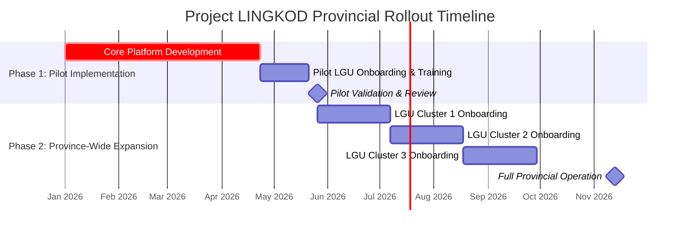

# Project LINGKOD: Provincial Rollout Implementation Plan

**Date:** September 3, 2025
**Version:** 2.0 (Provincial Scope)

## 1. Introduction

This document outlines the strategic, three-phase implementation plan for the province-wide rollout of the **LINGKOD Emergency Command Platform** in Camarines Sur. This plan provides a clear roadmap for the full-scale deployment of the platform, moving from a validated pilot to a comprehensive, province-wide intelligence and early-warning system.

The objective is to systematically build, validate, and scale the platform's core modules—from the **Threat Analysis Engine** to the **Last-Mile Communication Hub**—to ensure maximum impact and a successful partnership with the Provincial Government.

The timeline and resource estimates are based on a project start date of **January 2026**.

## 2. Recommended Team Composition

The team structure is designed to scale with the project's phases. The core team will be consistent, with the potential to add specialists during the expansion and advanced capabilities phases.

*   **Project Manager (1):** Manages the overall program.
*   **Lead Backend Engineer (1):** Oversees technical architecture.
*   **Backend Engineer (2):** Develops services and APIs.
*   **Lead Frontend Engineer (1):** Oversees UI/UX development.
*   **Frontend Engineer (2):** Builds the user interfaces.
*   **QA Engineer (1):** Manages testing and quality assurance.
*   **Implementation & Training Specialist (1):** (Joins in Phase 2) Responsible for LGU onboarding and training.

---

## 3. Phase 1: Pilot Implementation & Validation

**Goal:** Deploy and validate the core Project LINGKOD system in a controlled, real-world environment with 3-4 high-risk, representative municipalities.
**Estimated Duration:** 5 Months
**Estimated Effort:** 48 Person-Weeks

### 3.1. Scope & Deliverables
*   **Core Platform Development:** Full implementation of the LINGKOD Emergency Command Platform, including the Data Ingestion, Threat Analysis Engine, Alert Management Dashboard, and Communication Hub modules.
*   **Phase 1 Insight Catalog Implementation:** Configuration and validation of the core predictive insights, including Barangay Flood and Landslide Watch, Quake Rapid Impact Estimation, and the Hotspot Escalation Score.
*   **Pilot LGU Onboarding:** Configuration and deployment of the platform for 3-4 selected high-risk municipalities, including ingestion of LGU-specific data (critical facilities, etc.).
*   **Operator Training:** Intensive, hands-on training for PDRRMO and pilot MDRRMOs on the full alert management lifecycle, from insight review to public dissemination.
*   **Pilot Validation Report:** A comprehensive report detailing system performance against KPIs, user feedback, and actionable recommendations for the full province-wide expansion.

### 3.2. Work Breakdown

| Task ID | Description | Discipline | Effort (Person-Weeks) |
| :--- | :--- | :--- | :--- |
| P1-PL-01 | Finalize selection of pilot municipalities with PDRRMO. | PM | 1 |
| P1-BE-01 | Develop and deploy core backend services (Data Ingestion, Threat Analysis, Auth, etc.). | Backend | 12 |
| P1-BE-02 | Implement core database schemas and establish initial data integrations. | Backend | 4 |
| P1-FE-01 | Develop the full Admin/Operator Dashboard UI. | Frontend | 12 |
| P1-FE-02 | Develop the Alert Management workflow UI. | Frontend | 4 |
| P1-QA-01 | Conduct full functional, integration, and security testing of the core platform. | QA | 8 |
| P1-PM-01 | Conduct initial training sessions and gather user feedback. | PM | 3 |

---

## 4. Phase 2: Province-Wide Expansion

**Goal:** Systematically scale the validated system to cover all municipalities and cities in Camarines Sur.
**Estimated Duration:** 6 Months (Post-Phase 1)
**Estimated Effort:** Billed per LGU/Cluster to provide scalable costing.

### 4.1. Scope & Deliverables
*   Onboarding of all remaining LGUs in Camarines Sur, grouped into logical clusters.
*   Scaling of cloud infrastructure to handle province-wide data loads.
*   A comprehensive, province-wide training program for all operators.
*   Establishment of a provincial support and maintenance protocol.
*   Fully operational, province-wide Early Warning System.

### 4.2. Work Breakdown (Per LGU Cluster)

| Task ID | Description | Discipline |
| :--- | :--- | :--- |
| P2-PL-01 | LGU Cluster Kick-off and requirements gathering. | PM / Training |
| P2-CF-01 | Configuration of LGU-specific rule packs, boundaries, and communication templates. | Backend |
| P2-TR-01 | On-site and remote training for the LGU's DRRMO team. | Training |
| P2-SU-01 | Go-live and post-launch support for the LGU cluster. | All |

---

## 5. Phase 3: Advanced Capabilities & Integration

**Goal:** Enhance the system with advanced features and full integration into the provincial ecosystem.
**Estimated Duration:** Varies by module
**Estimated Effort:** Billed per module.

### 5.1. Scope & Deliverables
This phase consists of optional, high-value modules that can be implemented based on the province's evolving needs.

### 5.2. Available Modules

| Module ID | Description | Discipline |
| :--- | :--- | :--- |
| P3-INT-01 | **Live Third-Party Integration:** Full, production-grade integration with Coram.ai, DMA-BD, and satellite providers. | Backend |
| P3-ML-01 | **Advanced Prediction Models:** Develop and integrate machine learning models for more nuanced threat prediction (e.g., landslide susceptibility). | Backend / Data Science |
| P3-PUB-01 | **Public Information Portal:** Develop a full-featured public portal for citizens with alert subscriptions and safety information. | Frontend / Backend |
| P3-API-01 | **Provincial Systems Integration:** Develop custom API integrations with other relevant provincial government systems (e.g., health, agriculture). | Backend |

---

## 6. High-Level Provincial Rollout Timeline

This timeline assumes a project start date of **January 1, 2026**.

**Key Milestones:**

*   **End of Pilot Development (Apr 2026):** Core platform is built and ready for pilot deployment.
*   **Pilot Validation Complete (May 2026):** System is validated in a real-world setting.
*   **Full Provincial Operation (Nov 2026):** All LGUs in Camarines Sur are onboarded and the system is fully operational.
