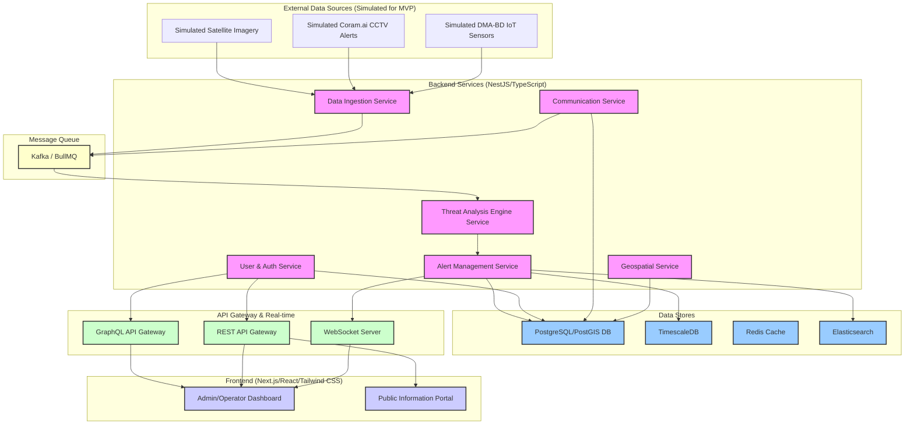

# Project LINGKOD: MVP Technical Specification

**Date:** August 30, 2025

**Author:** Synthesiq Technologies

---

## 1. Introduction

This document provides a detailed technical specification for the Minimum Viable Product (MVP) of Project LINGKOD. The MVP aims to serve as a compelling demonstration platform for potential clients (LGUs, cities, provinces like Metro Manila), showcasing the system's capabilities in multi-hazard prediction, real-time situational awareness, and targeted communication. This specification outlines the architecture, technology stack, data models, and implementation guidelines required for development.

## 2. System Architecture Overview

Project LINGKOD will be built as a cloud-native, microservices-oriented platform designed for scalability, resilience, and multi-tenancy. It will consist of several loosely coupled services communicating via APIs and message queues.



## 3. Technology Stack

### 3.1. Backend
- **Language:** TypeScript
- **Framework:** NestJS (Node.js)
- **Databases:**
    - **PostgreSQL 15+ with PostGIS:** Primary relational database for core application data (users, alerts, configurations, geospatial data).
    - **TimescaleDB:** Extension for PostgreSQL, optimized for time-series data (IoT sensor readings).
    - **Redis 7+:** In-memory data store for caching, real-time data streams, and WebSocket session management.
    - **Elasticsearch:** For full-text search on alert history, logs, and complex analytical queries.
- **Message Queue:** Apache Kafka (for high-throughput data ingestion) or BullMQ (for background job processing).
- **Real-time:** WebSocket server (integrated with NestJS Gateway).
- **API:** GraphQL (for flexible client queries) and REST APIs (for standard integrations).
- **Authentication:** JWT (JSON Web Tokens) with OAuth2.0 for enterprise-grade security.

### 3.2. Frontend
- **Framework:** Next.js 14+ (React) with TypeScript
- **Styling:** Tailwind CSS
- **UI Components:** Headless UI, Radix UI (for accessible, unstyled components)
- **State Management:** Zustand (lightweight global state) + TanStack Query (server state management, caching, real-time data synchronization).
- **Mapping:** Mapbox GL JS (interactive maps) + Deck.gl (advanced geospatial data visualization).
- **Charting:** Chart.js or Recharts (for data visualization in dashboards).
- **Animations:** Framer Motion (for smooth UI transitions).

### 3.3. Development & DevOps
- **Containerization:** Docker
- **Orchestration:** Kubernetes (for production deployment, optional for MVP demo)
- **CI/CD:** GitHub Actions
- **Infrastructure as Code (IaC):** Terraform
- **Monitoring & Logging:** Prometheus, Grafana, Sentry

## 4. Data Models & Schemas

### 4.1. Sensor Data (TimescaleDB)
- **Table:** `sensor_readings`
- **Schema:**
    ```sql
    CREATE TABLE sensor_readings (
        id UUID PRIMARY KEY DEFAULT gen_random_uuid(),
        station_id VARCHAR(255) NOT NULL,
        timestamp TIMESTAMPTZ NOT NULL,
        sensor_type VARCHAR(50) NOT NULL, -- e.g., 'AWLG', 'ARG', 'AWS'
        value_numeric NUMERIC, -- For AWLG, ARG, temperature, windSpeed
        value_json JSONB, -- For complex AWS data (humidity, etc.)
        location GEOMETRY(Point, 4326) NOT NULL, -- PostGIS point
        metadata JSONB, -- e.g., sensor calibration, status
        CONSTRAINT unique_reading UNIQUE (station_id, timestamp, sensor_type)
    );
    SELECT create_hypertable('sensor_readings', 'timestamp');
    ```
- **Simulated Data:** Generate realistic time-series data for AWLG, ARG, AWS based on historical weather patterns and configurable scenarios (normal, typhoon, flood).

### 4.2. CCTV Alert Data (PostgreSQL)
- **Table:** `cctv_alerts`
- **Schema:**
    ```sql
    CREATE TABLE cctv_alerts (
        id UUID PRIMARY KEY DEFAULT gen_random_uuid(),
        alert_id VARCHAR(255) UNIQUE NOT NULL, -- Coram.ai's alert ID
        timestamp TIMESTAMPTZ NOT NULL,
        event_type VARCHAR(100) NOT NULL, -- e.g., 'RapidWaterLevelRise', 'LandslideDetected'
        severity INTEGER NOT NULL, -- 1-5
        source_camera_id VARCHAR(255) NOT NULL,
        location GEOMETRY(Point, 4326) NOT NULL,
        raw_data JSONB, -- Raw payload from Coram.ai
        created_at TIMESTAMPTZ DEFAULT NOW()
    );
    ```
- **Simulated Data:** Generate alerts based on predefined scenarios, linking to simulated sensor data for correlation.

### 4.3. Satellite Imagery Metadata (PostgreSQL)
- **Table:** `satellite_imagery`
- **Schema:**
    ```sql
    CREATE TABLE satellite_imagery (
        id UUID PRIMARY KEY DEFAULT gen_random_uuid(),
        capture_date DATE NOT NULL,
        provider VARCHAR(100) NOT NULL,
        image_url TEXT NOT NULL, -- URL to a simulated image or placeholder
        analysis_results JSONB, -- e.g., soil moisture, vegetation index
        coverage_area GEOMETRY(Polygon, 4326) NOT NULL,
        created_at TIMESTAMPTZ DEFAULT NOW()
    );
    ```
- **Simulated Data:** Placeholder URLs and basic analysis results for demo purposes.

### 4.4. Generated Alerts (PostgreSQL)
- **Table:** `system_alerts`
- **Schema:**
    ```sql
    CREATE TABLE system_alerts (
        id UUID PRIMARY KEY DEFAULT gen_random_uuid(),
        alert_id VARCHAR(255) UNIQUE NOT NULL, -- Internal system ID
        timestamp TIMESTAMPTZ NOT NULL,
        area_municipality VARCHAR(255) NOT NULL,
        area_barangay VARCHAR(255),
        geometry GEOMETRY(Polygon, 4326) NOT NULL, -- GeoJSON polygon
        description TEXT NOT NULL,
        severity INTEGER NOT NULL, -- 1-5
        status VARCHAR(50) NOT NULL DEFAULT 'Draft', -- Draft, Pending Review, Approved, Disseminated, Rescinded
        rule_pack_version VARCHAR(50) NOT NULL,
        triggered_rules JSONB, -- Array of rules that fired
        contributing_signals JSONB, -- References to sensor_readings.id, cctv_alerts.id
        operator_notes TEXT,
        approved_by UUID REFERENCES users(id),
        approved_at TIMESTAMPTZ,
        created_at TIMESTAMPTZ DEFAULT NOW(),
        updated_at TIMESTAMPTZ DEFAULT NOW()
    );
    ```

### 4.5. Users (PostgreSQL)
- **Table:** `users`
- **Schema:**
    ```sql
    CREATE TABLE users (
        id UUID PRIMARY KEY DEFAULT gen_random_uuid(),
        username VARCHAR(255) UNIQUE NOT NULL,
        password_hash TEXT NOT NULL,
        email VARCHAR(255) UNIQUE NOT NULL,
        role VARCHAR(50) NOT NULL, -- e.g., 'Admin', 'Operator', 'Viewer'
        lgu_id UUID REFERENCES lgus(id), -- For multi-tenancy
        is_active BOOLEAN DEFAULT TRUE,
        created_at TIMESTAMPTZ DEFAULT NOW(),
        updated_at TIMESTAMPTZ DEFAULT NOW()
    );
    ```

### 4.6. LGUs (PostgreSQL) - Multi-tenancy
- **Table:** `lgus`
- **Schema:**
    ```sql
    CREATE TABLE lgus (
        id UUID PRIMARY KEY DEFAULT gen_random_uuid(),
        name VARCHAR(255) UNIQUE NOT NULL,
        region VARCHAR(255),
        province VARCHAR(255),
        city_municipality VARCHAR(255),
        configuration JSONB, -- LGU-specific settings, e.g., alert thresholds, communication channels
        created_at TIMESTAMPTZ DEFAULT NOW()
    );
    ```

## 5. Backend Service Specifications

### 5.1. Data Ingestion Service
- **Purpose:** Ingests raw data from simulated external sources.
- **Endpoints:**
    - `POST /ingest/cctv`: Receives simulated Coram.ai alerts.
    - `POST /ingest/iot`: Receives simulated DMA-BD sensor data.
    - `GET /ingest/satellite`: Triggers simulated satellite data pull.
- **Logic:** Validates incoming data, enriches with geospatial context, publishes to Kafka/BullMQ for processing.

### 5.2. Threat Analysis Engine Service
- **Purpose:** Core logic for data correlation and rule evaluation.
- **Consumers:** Subscribes to Kafka/BullMQ for raw data.
- **Logic:**
    - **Data Correlation:** Correlates sensor, CCTV, and satellite data based on time and proximity.
    - **Rule Evaluation:** Applies predefined and LGU-specific rule packs (YAML/JSON configuration) to correlated data.
        - **Example Rules (from Pilot Technical Scope):**
            - `Flash Flood Rule`: `(ARG > 20mm/hr for 1hr)` AND `(AWLG increase > 0.5m in 15min)` -> **Severity 3 Alert**.
            - `Sustained Rainfall Rule`: `(ARG > 10mm/hr for 3hrs)` -> **Severity 2 Alert**.
    - **Alert Generation:** Creates `system_alerts` entries when rules are met, including `triggered_rules` and `contributing_signals`.
    - **Publishing:** Publishes new/updated alerts to Redis/WebSocket for real-time dashboard updates.

### 5.3. Alert Management Service
- **Purpose:** Manages the lifecycle of generated alerts.
- **Endpoints:**
    - `GET /alerts`: Retrieve all alerts (filterable by LGU, status, severity, time).
    - `GET /alerts/:id`: Retrieve single alert with full details (evidence panel).
    - `POST /alerts/:id/approve`: Operator action to approve an alert.
    - `POST /alerts/:id/rescind`: Operator action to rescind an alert.
    - `PUT /alerts/:id`: Update alert details (e.g., operator notes, geometry adjustments).
- **Logic:** Handles state transitions (`Draft` -> `Pending Review` -> `Approved` -> `Disseminated` -> `Rescinded`), audit logging, and operator actions.

### 5.4. User & Authentication Service
- **Purpose:** Manages user accounts, roles, and authentication.
- **Endpoints:**
    - `POST /auth/login`: User login, returns JWT.
    - `POST /auth/register`: New user registration (admin-only).
    - `GET /users/me`: Get current user profile.
    - `GET /users/:id`: Get user details (admin-only).
    - `PUT /users/:id`: Update user details (admin-only).
- **Logic:** JWT generation and validation, password hashing, role-based access control (RBAC).

### 5.5. Communication Service
- **Purpose:** Generates and manages communication templates.
- **Endpoints:**
    - `POST /communications/generate-sms`: Generate SMS content for an alert.
    - `POST /communications/generate-radio`: Generate radio script for an alert.
    - `POST /communications/generate-barangay`: Generate official alert for barangay.
- **Logic:** Uses predefined templates (stored in DB or config) and alert data to generate localized, actionable messages. For MVP, this will generate text content, not send actual messages.

### 5.6. Geospatial Service
- **Purpose:** Provides geospatial utilities and data.
- **Endpoints:**
    - `GET /geospatial/barangays`: Retrieve barangay boundaries (GeoJSON).
    - `GET /geospatial/municipalities`: Retrieve municipality boundaries (GeoJSON).
    - `GET /geospatial/rivers`: Retrieve river network data (GeoJSON).
    - `POST /geospatial/point-in-polygon`: Determine if a point is within a given administrative boundary.
- **Logic:** Leverages PostGIS for efficient geospatial queries.

## 6. Frontend Specifications

### 6.1. Admin/Operator Dashboard (Next.js/React/Tailwind CSS)
- **Layout:** Responsive, multi-column layout with a primary map view.
- **Components:**
    - **Interactive Map:** Mapbox GL JS displaying:
        - Base map (satellite/street view)
        - LGU boundaries (provinces, cities, barangays)
        - Sensor locations (IoT, CCTV) with real-time status indicators
        - Active alert polygons (GeoJSON from `system_alerts`)
        - Simulated hazard overlays (e.g., flood extent, storm surge)
    - **Real-time Data Feeds:** Display latest sensor readings, CCTV events.
    - **Alert List/Table:** Filterable, sortable list of `system_alerts`.
    - **Alert Detail Panel:**
        - Comprehensive view of a selected alert.
        - **Evidence Panel:** Displays contributing sensor readings, CCTV snapshots, rule traces, confidence scores.
        - **Operator Actions:** Buttons for `Approve`, `Rescind`, `Edit` (with audit trail).
        - **Communication Preview:** Shows generated SMS, radio, barangay messages.
    - **User Management:** CRUD operations for users (Admin role).
    - **LGU Management:** CRUD operations for LGUs (Admin role), including configuration of rule packs and communication settings.
    - **Historical Data & Analytics:** Basic charts for sensor trends, alert frequency, operator response times.
- **Styling:** Tailwind CSS for consistent, modern UI. Headless UI/Radix UI for accessible components. Framer Motion for smooth transitions.

### 6.2. Public Information Portal (Next.js/React/Tailwind CSS)
- **Purpose:** A simplified, read-only view for public consumption (optional for MVP, but good for demo).
- **Components:**
    - **Map View:** Displays active public alerts (approved `system_alerts`) and general hazard information.
    - **Alert List:** Simplified list of public alerts.
    - **Information Pages:** About Project LINGKOD, safety tips, emergency contacts.
- **Styling:** Tailwind CSS, mobile-first responsive design.

## 7. Security & Authentication

- **User Authentication:** JWT-based authentication with OAuth2.0 flows.
- **Authorization:** Role-Based Access Control (RBAC) for API endpoints and UI features.
- **Data Encryption:** Encryption in transit (HTTPS/TLS) and at rest (database encryption).
- **API Security:** Rate limiting, input validation, protection against common web vulnerabilities (OWASP Top 10).
- **Multi-Tenancy:** Strict data isolation between LGUs. Users are scoped to their respective LGU.

## 8. Deployment & Infrastructure

- **Cloud Provider:** Cloud-agnostic design, but initial deployment target could be AWS, Azure, or GCP.
- **Containerization:** All services deployed as Docker containers.
- **Orchestration:** Kubernetes for production (optional for MVP, can use Docker Compose for local/single-server demo).
- **Database Hosting:** Managed database services (e.g., AWS RDS, Azure Database for PostgreSQL).
- **Networking:** VPCs, subnets, security groups for secure network isolation.
- **Load Balancing:** API Gateway and load balancers for traffic distribution.
- **CDN:** For frontend assets.

## 9. Integration Specifications

### 9.1. Simulated External Data Sources
- **API Mocking:** Create mock APIs or data generators that mimic the expected Coram.ai, DMA-BD, and satellite provider APIs.
- **Data Formats:** Adhere to the schemas defined in `docs/Pilot_Technical_Scope.md` for simulated data.

### 9.2. External Command Center API (Complementary Mode)
- **Endpoint:** `GET /api/v1/alerts`
- **Authentication:** Bearer Token (JWT).
- **Output Format:** GeoJSON FeatureCollection of active, approved alerts.
- **CAP 1.2:** `GET /api/v1/cap/{alertId}` for Common Alerting Protocol XML.
- **Rate Limiting:** Configurable per client.

## 10. Performance Requirements

- **Data Ingestion:** Handle up to 1000 sensor readings/CCTV alerts per second.
- **Threat Analysis:** Process and generate alerts within 5 seconds of receiving critical data.
- **Dashboard Latency:** Real-time updates (via WebSockets) within 1 second.
- **API Response Time:** P95 latency < 200ms for core API endpoints.
- **Scalability:** Architecture should support scaling to hundreds of LGUs and millions of citizens.

## 11. Development Guidelines

- **Coding Standards:** Adhere to TypeScript/JavaScript best practices, ESLint, Prettier.
- **Testing:**
    - **Unit Tests:** For all core logic (services, utilities, rule evaluation).
    - **Integration Tests:** For API endpoints and service interactions.
    - **End-to-End Tests:** For critical user flows (e.g., alert generation to dashboard display).
- **Documentation:** Comprehensive JSDoc/TSDoc for code, OpenAPI/Swagger for APIs.
- **Version Control:** Git with a branching strategy (e.g., GitFlow or GitHub Flow).
- **Code Review:** Mandatory for all changes.

## 12. Multi-Region Configuration

- **LGU-Specific Settings:** Each LGU will have its own configuration for:
    - Rule packs (thresholds, logic)
    - Communication templates (language, channels)
    - User roles and permissions
    - Geospatial boundaries
- **Tenant Isolation:** Data access will be strictly isolated based on the authenticated user's LGU.
- **Regional Data:** Ability to load and display specific geographic data (barangays, rivers) for the selected LGU/region.

---
