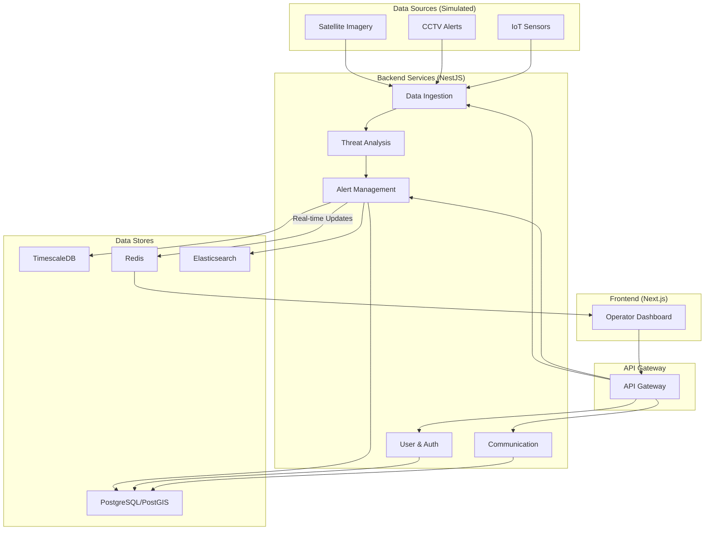

# System Patterns: Project LINGKOD

## 1. Core Architectural Pattern: Microservices

Project LINGKOD is built on a **microservices-oriented architecture**. This pattern is chosen for its scalability, resilience, and maintainability. Each service is a self-contained unit with a specific business capability, communicating with other services via well-defined APIs.

**For a detailed breakdown of the architecture, see:**
- `docs/03-architecture/system-architecture/technical-specification.md`

## 2. Key Architectural Decisions (ADRs)

Our architecture is guided by a series of formal Architecture Decision Records (ADRs). The key decisions are:

- **ADR-001: Technology Stack Selection:** The project uses a modern, TypeScript-based stack including NestJS (backend), Next.js (frontend), and PostgreSQL.
- **ADR-002: Database Selection:** We use PostgreSQL with PostGIS and TimescaleDB extensions to handle relational, geospatial, and time-series data in a unified system.
- **ADR-003: Frontend Framework Selection:** We use Next.js with React for its powerful features and developer experience.

**For full details, see:**
- `docs/03-architecture/decisions/`

## 3. System Design Patterns

### 3.1. Dual-Mode Intelligence Engine

The system is designed to operate in two modes:
1.  **Standalone Platform:** A complete, end-to-end solution with its own dashboard.
2.  **Complementary Engine:** An intelligence provider that feeds alerts to existing third-party systems via API.

### 3.2. Proactive Intelligence vs. Reactive Dispatch

LINGKOD is a **proactive early-warning system**, not a reactive dispatch system. It is designed to predict and analyze threats *before* they require an emergency response.

### 3.3. Human-in-the-Loop

All alerts generated by the system require **manual operator approval** before any public dissemination, ensuring accuracy and accountability. This is a critical safety and trust feature.

### 3.4. Insight-Driven Intelligence Pattern

The platform follows an **Insight-Driven Intelligence Pattern**, where raw data is transformed into actionable, predictive insights rather than just aggregated information. Key elements include:
*   **Insight Catalog:** A structured set of predefined insights (e.g., Flood Watch, Landslide Watch, Quake Impact) that provide specific, time-bound recommendations.
*   **Evidence Panel:** Each insight includes an explainable evidence panel showing contributing data sources, thresholds, and rule traces for transparency and trust.
*   **Priority Queue:** Insights are ranked by exposure-weighted risk to guide operator focus on the most critical areas.
*   **Recommendation Engine:** SOP-linked recommendations that auto-generate communication templates for SMS, radio, and official alerts.
*   **Human-in-the-Loop Workflow:** All insights require operator review and approval before becoming public alerts, with full audit trails.

## 4. Component Diagram

This diagram reflects the microservices architecture outlined in the technical specification.

## 5. Business Patterns

### 5.1. B2B Partnership Model

Project LINGKOD operates through a **B2B (Business-to-Business) Partnership Model** where Getaka Labs provides the core technology platform to strategic partners like RDG Digital Consulting. This model includes:

*   **Exclusive Reseller & Implementation Partnership:** RDG Digital Consulting is designated as our exclusive partner for the LGU sector in the Philippines, giving them a unique competitive advantage.
*   **Technology Licensing:** Getaka Labs licenses the core LINGKOD platform to RDG, who then leads the sales, implementation, and client management for provincial deployments.
*   **Revenue Sharing:** A royalty-based revenue sharing agreement ensures both parties benefit from future deployments.
*   **IP Ownership Framework:** Getaka Labs retains ownership of the core platform IP, while RDG can own IP for bespoke customizations developed for specific clients.

### 5.2. Phased Feature Roadmap Alignment

The project follows a **Phased Feature Roadmap Alignment Pattern** where initial investments cover the MVP (Phase 1) features, with advanced capabilities from Phase 2 and 3 scoped separately:

*   **Phase 1 (MVP):** Core insight generation, operator dashboard, and communication hub.
*   **Phase 2 (Community Intelligence):** Community Intelligence Module, Dynamic Briefing Dashboard, and logistics/resource management.
*   **Phase 3 (Advanced Analytics):** Rapid Impact Analysis, Advanced Predictive Analytics, and Public Information Portal.

This pattern ensures clear scoping, stable costing for initial phases, and a natural progression for future enhancements.

## 6. Security Patterns

The system follows a **Defense in Depth** and **Zero Trust** security model. Key patterns include:

- **JWT-based Authentication** for users.
- **Role-Based Access Control (RBAC)** for authorization.
- **Data Encryption** in transit (TLS) and at rest.
- **Strict Network Segmentation** using a VPC and security groups.

**For full details, see:**
- `docs/03-architecture/security/security-architecture.md`

## 7. Frontend Patterns

### 7.1. Dark Mode Theme

The application supports a dark mode theme to enhance user experience in low-light environments. The implementation follows these patterns:

- **Class-Based Theming:** Dark mode is enabled by adding a `dark` class to the `<html>` element.
- **Theme Provider:** The `next-themes` library is used to manage theme switching and persistence.
- **CSS Variables:** A comprehensive set of CSS variables for colors is defined in `src/app/globals.css` for both light and dark modes. This ensures a consistent and easily maintainable color scheme.
- **Component Styling:** All components use Tailwind's `dark:` variants to apply specific styles for dark mode. The color palette is managed through CSS variables, which are then referenced in the `tailwind.config.js` file. This allows for a single source of truth for all theme-related colors.
- **Theming Strategy:** The application uses a centralized theming strategy where all color definitions are stored in `globals.css` as CSS variables. The `tailwind.config.js` file is configured to use these variables, which allows for dynamic theme switching without requiring a rebuild of the CSS. This approach ensures that all components, including buttons, dropdowns, and other UI elements, correctly adapt their styling when the theme changes.

### 7.2. Semantic Button Hierarchy

To ensure a clear and intuitive user experience, the application employs a semantic button hierarchy. This system is designed to visually distinguish between primary, secondary, and tertiary actions, guiding the user and reducing the risk of incorrect actions in a high-stakes environment.

- **Semantic Variants:** The `Button` component uses a set of semantic variants to define the visual importance of an action:
  - `primary`: For the most critical, affirmative action on a view (e.g., "Approve").
  - `secondary`: For less critical actions that are still important (e.g., "Edit Geometry").
  - `tertiary`: For actions that should be de-emphasized (e.g., "Cancel").
  - `destructive`: For actions that result in the deletion of data and have significant consequences.
  - `destructive-outline`: For destructive actions that are secondary in nature, providing a clear warning without being as prominent as the primary destructive style (e.g., "Rescind").

- **CSS Variable-Driven:** The styles for these variants are defined using a dedicated set of CSS variables in `globals.css` for both light and dark modes. This ensures a consistent and easily maintainable implementation.

- **Usage Guidelines:** Developers should select the button variant that best matches the semantic meaning of the action, rather than its appearance. This ensures a consistent and predictable user interface across the entire application.

### 7.3. Atomic Component Library

The frontend is built using a custom-designed component library that follows the principles of Atomic Design. This ensures a high degree of consistency, reusability, and maintainability. All core components have been implemented in `frontend-new/src/components/ui/` and are accompanied by detailed UX specifications.

**Core Components:**

*   **`InsightCard`**: The primary summary view for an insight.
*   **`Button`**: The core interactive element with a full semantic hierarchy.
*   **`Icon`**: The standardized SVG icon rendering component.
*   **`StatusIndicator`**: The visual indicator for an insight's lifecycle state.
*   **`Tag`**: The component for labeling and categorization.
*   **`SearchBar`**: A dedicated input field for searching.
*   **`FilterDropdown`**: A dropdown with checkboxes for multi-select filtering.
*   **`TabNavigation`**: The tab system used to switch between different views.
*   **`DataCard`**: A small card for displaying a single data point.
*   **`TextArea`**: A multi-line text input for adding notes.
*   **`Badge`**: A generic component for displaying statuses and other labels.
*   **`Dropdown`**: A dropdown component that was recently fixed to address a transparency issue. The fix involved applying a standard Tailwind CSS background color directly to the component to ensure it displays correctly in both light and dark modes.
