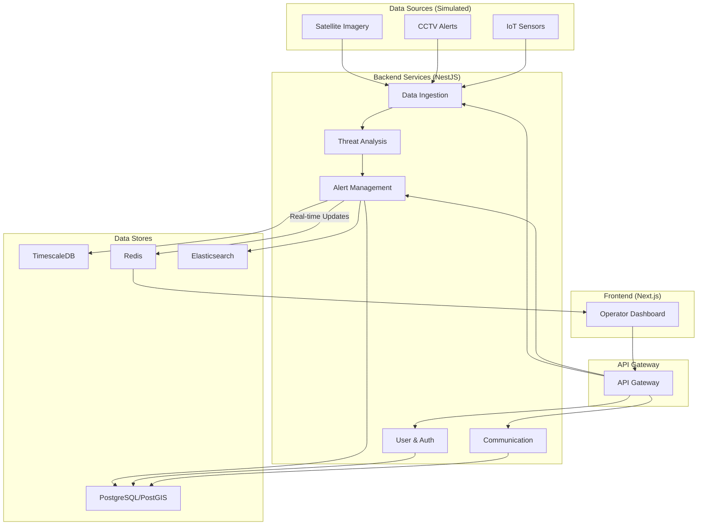

# System Patterns: Project LINGKOD

## 1. Core Architectural Pattern: Microservices

Project LINGKOD is built on a **microservices-oriented architecture**. This pattern is chosen for its scalability, resilience, and maintainability. Each service is a self-contained unit with a specific business capability, communicating with other services via well-defined APIs.

**For a detailed breakdown of the architecture, see:**
- `docs/03-architecture/system-architecture/technical-specification.md`

## 2. Key Architectural Decisions (ADRs)

Our architecture is guided by a series of formal Architecture Decision Records (ADRs). The key decisions are:

- **ADR-001: Technology Stack Selection:** The project uses a modern, TypeScript-based stack including NestJS (backend), Next.js (frontend), and PostgreSQL.
- **ADR-002: Database Selection:** We use PostgreSQL with PostGIS and TimescaleDB extensions to handle relational, geospatial, and time-series data in a unified system.
- **ADR-003: Frontend Framework Selection:** We use Next.js with React for its powerful features and developer experience.

**For full details, see:**
- `docs/03-architecture/decisions/`

## 3. System Design Patterns

### 3.1. Dual-Mode Intelligence Engine

The system is designed to operate in two modes:
1.  **Standalone Platform:** A complete, end-to-end solution with its own dashboard.
2.  **Complementary Engine:** An intelligence provider that feeds alerts to existing third-party systems via API.

### 3.2. Proactive Intelligence vs. Reactive Dispatch

LINGKOD is a **proactive early-warning system**, not a reactive dispatch system. It is designed to predict and analyze threats *before* they require an emergency response.

### 3.3. Human-in-the-Loop

All alerts generated by the system require **manual operator approval** before any public dissemination, ensuring accuracy and accountability. This is a critical safety and trust feature.

## 4. Component Diagram

This diagram reflects the microservices architecture outlined in the technical specification.

## 5. Security Patterns

The system follows a **Defense in Depth** and **Zero Trust** security model. Key patterns include:

- **JWT-based Authentication** for users.
- **Role-Based Access Control (RBAC)** for authorization.
- **Data Encryption** in transit (TLS) and at rest.
- **Strict Network Segmentation** using a VPC and security groups.

**For full details, see:**
- `docs/03-architecture/security/security-architecture.md`
